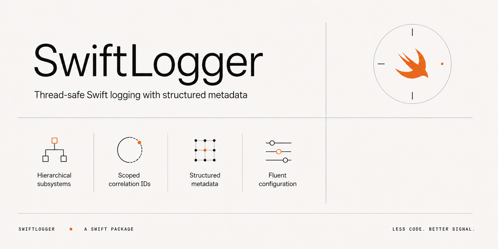

<p align="center">
  
</p>

<p align="center">
  
  
  
  
</p>

<br>

## Output

```
TRACE | 10:30:45.123 | TokenService.swift:18  | refresh initiated
DEBUG | 10:30:45.200 | APIClient.swift:88     | cache miss for /home
 INFO | 10:30:45.300 | AppDelegate.swift:15   | application launched
 WARN | 10:30:46.010 | TokenService.swift:91  | token expires in < 60s
ERROR | 10:30:46.500 | NetworkLayer.swift:203  | request failed: 503
 TODO | 10:30:47.000 | SyncWorker.swift:42    | implement retry backoff
```

Single line. Fixed-width level tags. No decoration.

## Install

```swift
.package(url: "https://github.com/AmirShayegh/SwiftLogger.git", from: "1.0.0")
```

```swift
.target(name: "MyApp", dependencies: ["Logger"])
```

## Usage

```swift
import Logger

Log("app launched")
Log("cache miss", level: .warning)

logDebug("request sent")
logError("connection failed")
```

Message expressions are `@autoclosure` -- interpolations and other message work are not evaluated when the level is filtered out.

## Configuration

All configuration methods return `self` for chaining:

```swift
Log.minimumLevel(.info)
   .consoleLogging(true)
   .fileLogging(true)
   .installExceptionHandler()
```

| Method | Default | Description |
|---|---|---|
| `minimumLevel(_:)` | `.debug` | Messages below this level are discarded |
| `consoleLogging(_:)` | `true` | Toggle `print()` output |
| `fileLogging(_:)` | `false` | Toggle file output to `Documents/app.log`. Check `isFileLoggingActive` to verify. |
| `logLevel(_:forFile:)` | -- | Override level for a specific source file |
| `resetLogLevel(forFile:)` | -- | Remove a per-file override |
| `highlight(_:)` | -- | Prefix output from a file with `>>>` |
| `removeHighlight(_:)` | -- | Remove the `>>>` prefix |
| `installExceptionHandler()` | off | Log uncaught `NSException`s. Chains to previous handler. Idempotent. |

## Levels

`verbose` < `debug` < `info` < `warning` < `error` < `todo`

Messages below the effective minimum are discarded. `@autoclosure` ensures filtered messages allocate nothing.

## Subsystems

Dot-separated hierarchy. A parent level applies to all children unless overridden.

```swift
Log.subsystem("network", level: .info)
   .subsystem("network.api", level: .debug)

Log("request sent", subsystem: "network.socket")   // inherits .info from "network"
Log("parsed body", level: .debug, subsystem: "network.api")  // uses own .debug
```

Resolution order: exact subsystem match > parent subsystem > per-file override > global minimum.

Use `resetSubsystem(_:)` to remove a subsystem level.

## Scoped Loggers

Tag concurrent work with correlation IDs.

```swift
let job = Log.scoped(correlation: "job-\(id)", subsystem: "sync")
job.info("started")
job.debug("record processed", metadata: ["count": 42])
```

```
 INFO | 10:30:45.123 | SyncWorker.swift:42 | [job-abc123] [sync] started
DEBUG | 10:30:45.200 | SyncWorker.swift:55 | [job-abc123] [sync] record processed {count=42}
```

Scoped loggers are `Sendable` value types with convenience methods for each level (`.verbose()`, `.debug()`, `.info()`, `.warning()`, `.error()`, `.todo()`).

They nest -- a child inherits the parent's subsystem unless overridden:

```swift
let pipeline = Log.scoped(correlation: "pipeline-1", subsystem: "pipeline")
let decode   = pipeline.scoped(correlation: "decode-1")              // keeps "pipeline"
let io       = pipeline.scoped(correlation: "io-1", subsystem: "io") // overrides to "io"
```

## Metadata

Type-safe key-value pairs via `LogValue`. Supports string, integer, float, and boolean literals directly.

```swift
Log("request done", metadata: ["status": 200, "cached": false, "ms": 142.5, "path": "/home"])
```

```
 INFO | 10:30:45.300 | APIClient.swift:88 | request done {cached=false, ms=142.5, path=/home, status=200}
```

Metadata keys are sorted alphabetically in the output.

## Thread Safety

All logger state is lock-protected. Each log destination manages its own synchronization. `ScopedLogger` is a `Sendable` value type with no mutable state. File writes are serialized on a dedicated dispatch queue. `DateFormatter` instances are thread-local to avoid contention.

## License

MIT
